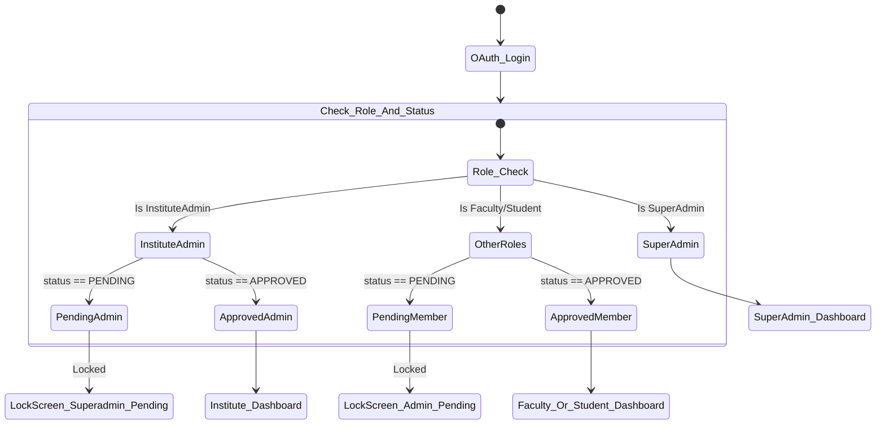

# System Architecture Design & Onboarding Workflow Integration

This document outlines the blueprint and implementation plan for introducing a strict, hierarchical approval workflow in our multi-tenant educational platform. All users utilize Google OAuth (SSO) as their identity provider.

---

## 1. Relational Database Schema Design (PostgreSQL-Optimized)

To support this system, the database tables, relations, and statuses are designed as follows:

```mermaid
erDiagram
    SUPERADMIN {
        UUID id PK
        VARCHAR name
        VARCHAR email UNIQUE
        TIMESTAMP created_at
    }
    
    INSTITUTE {
        UUID id PK
        VARCHAR legal_name
        VARCHAR brand_name
        VARCHAR phone_number
        VARCHAR physical_address
        VARCHAR email UNIQUE "Extracted from Google Auth"
        VARCHAR status "PENDING | APPROVED | SUSPENDED"
        TIMESTAMP created_at
    }

    USER {
        UUID id PK
        VARCHAR name
        VARCHAR email UNIQUE
        VARCHAR role "InstituteAdmin | Faculty | Student"
        UUID institute_id FK
        VARCHAR status "PENDING | APPROVED | SUSPENDED"
        TIMESTAMP created_at
    }

    COURSE {
        UUID id PK
        VARCHAR course_name
        VARCHAR code UNIQUE
        UUID institute_id FK
        UUID faculty_id FK "Creator / Assigned Faculty"
        TIMESTAMP created_at
    }

    COURSE_ENROLLMENT {
        UUID student_id PK, FK
        UUID course_id PK, FK
        VARCHAR enrollment_status "PENDING | APPROVED | REJECTED"
        TIMESTAMP requested_at
        TIMESTAMP processed_at
    }

    INSTITUTE ||--o{ USER : "has users"
    INSTITUTE ||--o{ COURSE : "contains"
    USER ||--o{ COURSE : "teaches (Faculty)"
    USER ||--o{ COURSE_ENROLLMENT : "requests (Student)"
    COURSE ||--o{ COURSE_ENROLLMENT : "receives"
```

### Current MongoDB (Mongoose) Model Mapping
Since our codebase runs on MongoDB, the following model modifications will represent this relational structure:
1. **`User` Schema**:
   * Add `status` field with enum values `["Pending", "Approved", "Suspended"]` defaulting to `"Pending"` for `Faculty` and `Student` roles.
   * `instituteId` field points to `Institute`.
2. **`Institute` Schema**:
   * Keep `status` field with enum values `["Pending", "Active", "Suspended"]` defaulting to `"Pending"`.
   * Add fields: `brandName`, `legalName`, `phoneNumber`, `address`, and `email` (extracted from Google OAuth).
3. **`Enrollment` Schema**:
   * Add `status` field with enum values `["Pending", "Approved", "Rejected"]` defaulting to `"Pending"` for Student course registrations.

---

## 2. Authentication & Guard Middleware Logic

To enforce strict role-based and approval status guards on the backend, routing middleware checks both `isAuthenticated` and `isApproved`.

### A. JWT Token Structure
The backend-issued JWT token contains:
```json
{
  "id": "user_id",
  "name": "User Name",
  "email": "user@domain.com",
  "role": "InstituteAdmin",
  "instituteId": "institute_id",
  "status": "Pending"
}
```

### B. Route Guard Middleware Flow
1. **`authenticate`**: Verifies that the JWT token is present in the Authorization header and is valid. Decodes user info.
2. **`checkApproved`**: Inspects `req.user.status` and `req.user.role`.
   * If `req.user.role === 'SuperAdmin'`, allow immediately.
   * If `req.user.role === 'InstituteAdmin'`, verify that both the User status is `"Approved"` and the linked `Institute.status` is `"Active"`. If either is `"Pending"` or `"Suspended"`, return `403 Forbidden`.
   * If `req.user.role === 'Faculty'` or `'Student'`, verify that the User status is `"Approved"`. If `"Pending"` or `"Suspended"`, return `403 Forbidden`.

---

## 3. Step-by-Step API Endpoint Design

### A. Registration & Onboarding Routes
1. **`POST /api/auth/register-institute`**:
   * **Payload**: `{ legalName, brandName, phoneNumber, address }`
   * **Logic**: Saves the signup form data in a secure, temporary state cookie or serializes it.
   * **Action**: Redirects user to `/api/auth/google` with a state parameter encoding the registration form details.
2. **`POST /api/auth/oauth-login`**:
   * **Payload**: `{ name, email, role, picture, registrationDetails }`
   * **Logic**:
     * If the email is associated with a user, return their details.
     * If registering as `InstituteAdmin`: Creates a `Pending` User and a `Pending` Institute using `registrationDetails` and the Google OAuth email.
     * If registering as `Faculty`/`Student`: Creates a `Pending` User linked to the selected `instituteId`.

### B. Hierarchical Approval Routes
1. **Superadmin (Approve/Reject Institutes)**:
   * **`PATCH /api/super/institutes/:id/status`**: Updates `Institute.status` to `Active` or `Suspended` and the associated admin user status.
2. **Institute Admin (Approve/Reject Staff & Students)**:
   * **`GET /api/admin/pending-users`**: Fetches all `Pending` users (Faculty and Students) belonging to the admin's `instituteId`.
   * **`PATCH /api/admin/users/:id/status`**: Sets user status to `Approved` or `Suspended`.
3. **Faculty (Approve/Reject Student Course Enrollments)**:
   * **`GET /api/faculty/courses/:courseId/pending-enrollments`**: Fetches all `Pending` enrollments for a specific course assigned to the requesting faculty member.
   * **`PATCH /api/faculty/courses/:courseId/enrollments/:studentId`**: Sets enrollment status to `Approved` or `Rejected`.

---

## 4. Onboarding Integration & Landing States (Frontend)

To enforce locked screens for pending users on the client-side:



### Locked Screens
* **`LockScreen_Superadmin_Pending`**: Displays message: *"Approval from Superadmin Pending. Your institute registry is being reviewed."*
* **`LockScreen_Admin_Pending`**: Displays message: *"Approval from Institute Admin Pending. Please contact your institution's administrator to activate your console."*

---

## User Review Required

> [!IMPORTANT]
> **Google OAuth Sign-Up Integration Strategy**:
> During Google OAuth, users select a role. If they choose `InstituteAdmin`, we must collect form details *before* executing the Google login redirect. We propose using a stateful base64-encoded `state` parameter in Google OAuth redirect requests to pass form data state stateless/securely back to our callback endpoint.

> [!WARNING]
> **Database Changes**:
> Enabling these hierarchical states requires updating current `User` statuses from `"Approved"` (default) to `"Pending"`. This represents a migration task for local accounts to avoid lockouts.

---

## Open Questions

> [!IMPORTANT]
> 1. **Rejection Handling**: Should rejected institutes and users be hard-deleted, or moved to a permanent `"Rejected"` status so they cannot re-register with the same email?
> 2. **Course Creation Control**: Can `Pending` faculty members view courses, or should they be completely barred from accessing any view except the pending state landing screen?

---

## Proposed Changes

### Database Models

#### [MODIFY] [User.ts](file:///home/sambhav/TBT/Lms/Tech/server/src/models/User.ts)
* Change default value of `status` to `"Pending"`.
* Enforce model validations for new fields.

#### [MODIFY] [Institute.ts](file:///home/sambhav/TBT/Lms/Tech/server/src/models/Institute.ts)
* Add fields: `brandName`, `legalName`, `phoneNumber`, `address`, `email`.

#### [MODIFY] [Enrollment.ts](file:///home/sambhav/TBT/Lms/Tech/server/src/models/Enrollment.ts)
* Add `status` field (`"Pending" | "Approved" | "Rejected"`).

### Middleware & Controllers

#### [MODIFY] [auth.ts](file:///home/sambhav/TBT/Lms/Tech/server/src/middleware/auth.ts)
* Implement `checkApproved` middleware checks.

#### [MODIFY] [authController.ts](file:///home/sambhav/TBT/Lms/Tech/server/src/controllers/authController.ts)
* Incorporate base64 registration data decoding in `oauthLogin`.

#### [MODIFY] [adminController.ts](file:///home/sambhav/TBT/Lms/Tech/server/src/controllers/adminController.ts)
* Add actions for viewing pending users and updating user statuses.

### Frontend Views & Routing

#### [MODIFY] [layout.tsx](file:///home/sambhav/TBT/Lms/Tech/client/src/app/dashboard/layout.tsx)
* Detect `session.status === 'Pending'` and lock rendering/redirect to the pending landing status pages.

---

## Verification Plan

### Automated Tests
* Run unit tests for `checkApproved` middleware verification under different user roles and approval scenarios.
* Assert database validation constraints using integration tests in Mocha/Jest.

### Manual Verification
* Perform registration flow for a new Institute Admin, verifying they get redirected to the Superadmin Pending landing screen.
* Process the approval via Superadmin console and confirm the Institute Admin dashboard opens instantly.
