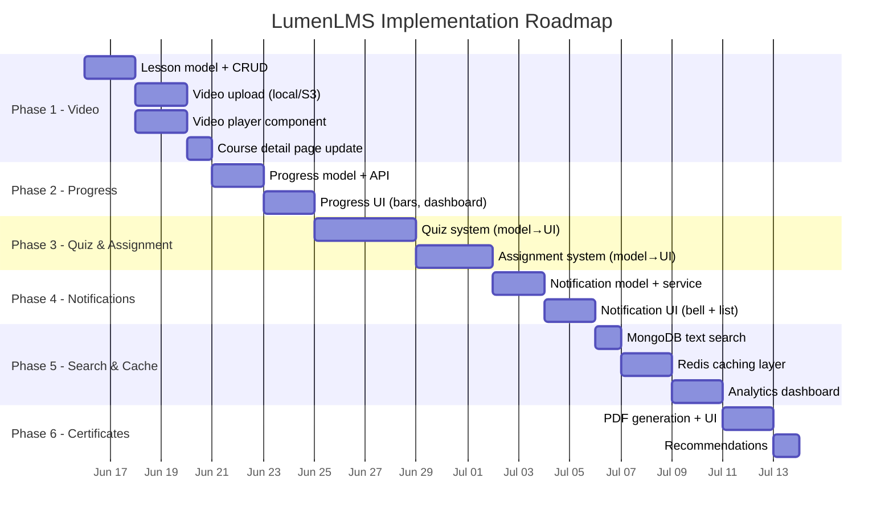

# LumenLMS — Implementation Plan

> Mapping [LMS_System_Design.md](file:///home/sambhav/TBT/Lms/Tech/LMS_System_Design.md) to current codebase and defining what's left.

---

## Current State Audit

### ✅ What's Already Built

| Area | Status | Key Files |
|---|---|---|
| **Auth (JWT + Google OAuth + RBAC)** | ✅ Complete | [auth.ts](file:///home/sambhav/TBT/Lms/Tech/server/src/middleware/auth.ts), [authController.ts](file:///home/sambhav/TBT/Lms/Tech/server/src/controllers/authController.ts) |
| **Multi-tenant Institute Model** | ✅ Complete | [Institute.ts](file:///home/sambhav/TBT/Lms/Tech/server/src/models/Institute.ts) |
| **User Model (4 roles + status)** | ✅ Complete | [User.ts](file:///home/sambhav/TBT/Lms/Tech/server/src/models/User.ts) |
| **Course CRUD** | ✅ Complete | [courseController.ts](file:///home/sambhav/TBT/Lms/Tech/server/src/controllers/courseController.ts) |
| **Enrollment (with approval flow)** | ✅ Complete | [Enrollment.ts](file:///home/sambhav/TBT/Lms/Tech/server/src/models/Enrollment.ts) |
| **Session scheduling (live links)** | ✅ Complete | [Session.ts](file:///home/sambhav/TBT/Lms/Tech/server/src/models/Session.ts) |
| **Material uploads (PDF via multer)** | ✅ Complete | [Material.ts](file:///home/sambhav/TBT/Lms/Tech/server/src/models/Material.ts), [upload.ts](file:///home/sambhav/TBT/Lms/Tech/server/src/middleware/upload.ts) |
| **SuperAdmin verification flow** | ✅ Complete | [Verification.ts](file:///home/sambhav/TBT/Lms/Tech/server/src/models/Verification.ts), [superController.ts](file:///home/sambhav/TBT/Lms/Tech/server/src/controllers/superController.ts) |
| **Billing Plans (seeded)** | ✅ Complete | [Plan.ts](file:///home/sambhav/TBT/Lms/Tech/server/src/models/Plan.ts) |
| **Subject management** | ✅ Complete | [Subject.ts](file:///home/sambhav/TBT/Lms/Tech/server/src/models/Subject.ts) |
| **Role dashboards (4 dashboards)** | ✅ Complete | admin/, faculty/, student/, super/ pages |
| **Calendar view for sessions** | ✅ Complete | [SessionCalendar.tsx](file:///home/sambhav/TBT/Lms/Tech/client/src/components/SessionCalendar.tsx) |
| **Pending-state lock screens** | ✅ Complete | [layout.tsx](file:///home/sambhav/TBT/Lms/Tech/client/src/app/dashboard/layout.tsx) |

### ❌ What's Missing (from System Design)

| System Design Feature | Status | Category |
|---|---|---|
| **Video upload & streaming** | ❌ Not started | Code + DevOps |
| **CDN-based video delivery** | ❌ Not started | **DevOps only** |
| **Quiz system (MCQ + subjective)** | ❌ Not started | Code |
| **Assignment submission & grading** | ❌ Not started | Code |
| **Progress tracking (watch events)** | ❌ Not started | Code + DevOps |
| **Notification service** | ❌ Not started | Code + DevOps |
| **Course search (Elasticsearch)** | ❌ Not started | Code + **DevOps** |
| **Certificate generation** | ❌ Not started | Code |
| **Analytics dashboard** | ❌ Not started | Code |
| **Redis caching layer** | ❌ Not started | Code + **DevOps** |
| **Lesson model (video_url, duration)** | ❌ Not started | Code |
| **Recommendation engine** | ❌ Not started | Code (ML) |

---

## Phase Breakdown

---

### Phase 1 — Lesson & Video Infrastructure
**Priority:** 🔴 Critical · **Effort:** ~1 week

The system design's `Lessons` table is the core content unit — currently missing entirely.

#### Code Tasks

| # | Task | Files to Create/Modify |
|---|---|---|
| 1.1 | Create `Lesson` model (`lesson_id, course_id, title, video_url, duration, order_no, description`) | `server/src/models/Lesson.ts` [NEW] |
| 1.2 | Create `lessonController.ts` — CRUD for lessons within a course, reorder support | `server/src/controllers/lessonController.ts` [NEW] |
| 1.3 | Create `lessonRoutes.ts` — `POST/GET/PUT/DELETE /api/courses/:courseId/lessons` | `server/src/routes/lessonRoutes.ts` [NEW] |
| 1.4 | Wire routes in [index.ts](file:///home/sambhav/TBT/Lms/Tech/server/src/index.ts) | MODIFY |
| 1.5 | Update course detail page to render ordered lesson list with video player | `client/src/app/dashboard/courses/[id]/page.tsx` MODIFY |
| 1.6 | Build video upload endpoint using multer (local) or presigned URL (S3) | `server/src/controllers/lessonController.ts` |
| 1.7 | Build `VideoPlayer` component (HTML5 `<video>` with controls, resume support) | `client/src/components/VideoPlayer.tsx` [NEW] |

#### 🔧 DevOps Tasks (Cannot be done by code alone)

| # | Task | Why DevOps? |
|---|---|---|
| D1.1 | **Set up S3 / GCS bucket** for video storage | Requires cloud console, IAM policies, bucket policies, CORS config |
| D1.2 | **Set up CloudFront / Cloud CDN** in front of the bucket | Requires DNS config, SSL cert, cache invalidation rules, signed URL keys |
| D1.3 | **Configure signed URL generation** secrets in environment | Requires secrets management (AWS Secrets Manager / .env on server) |
| D1.4 | **Set upload size limits** at reverse proxy level (Nginx/ALB) | `client_max_body_size` or ALB settings — not just Express config |

---

### Phase 2 — Progress Tracking System
**Priority:** 🔴 Critical · **Effort:** ~4 days

The system design specifies async processing via Kafka for high-volume watch events.

#### Code Tasks

| # | Task | Files |
|---|---|---|
| 2.1 | Create `Progress` model (`user_id, lesson_id, completed, last_watched_timestamp, watch_percentage`) | `server/src/models/Progress.ts` [NEW] |
| 2.2 | Create `progressController.ts` — `POST /api/progress` (upsert watch position), `GET /api/progress/:courseId` (per-course breakdown) | `server/src/controllers/progressController.ts` [NEW] |
| 2.3 | Create `progressRoutes.ts` and wire in index | [NEW] + MODIFY index.ts |
| 2.4 | Add course-level completion % calculation (count completed lessons / total lessons) | progressController |
| 2.5 | Build progress bar UI in course detail page and student dashboard overview | Client components |
| 2.6 | Emit watch-position events from `VideoPlayer` every 10s (debounced POST) | `VideoPlayer.tsx` MODIFY |

#### 🔧 DevOps Tasks

| # | Task | Why DevOps? |
|---|---|---|
| D2.1 | **Set up Kafka / RabbitMQ** for async event ingestion (production scale) | Requires provisioning message broker infra (managed Kafka on AWS/GCP or self-hosted) |
| D2.2 | **Deploy a consumer worker process** separate from the API server | Separate deployment unit, process manager, health checks |

> [!TIP]
> **MVP shortcut:** For now, do synchronous writes to MongoDB directly. Add Kafka consumer only when DAU exceeds ~10K and write latency becomes a bottleneck. The code abstraction should use a service layer so swapping sync→async is easy later.

---

### Phase 3 — Quiz & Assignment System
**Priority:** 🟡 High · **Effort:** ~1 week

#### Code Tasks

| # | Task | Files |
|---|---|---|
| 3.1 | Create `Quiz` model (`quiz_id, course_id, title, questions[], time_limit, created_by`) | `server/src/models/Quiz.ts` [NEW] |
| 3.2 | Create `Question` subdocument schema (`question_text, type[MCQ/Subjective], options[], correct_answer, points`) | Embedded in Quiz model |
| 3.3 | Create `QuizAttempt` model (`user_id, quiz_id, answers[], score, submitted_at, graded`) | `server/src/models/QuizAttempt.ts` [NEW] |
| 3.4 | Create `quizController.ts` — create quiz, submit attempt, auto-grade MCQs, manual grade subjective | `server/src/controllers/quizController.ts` [NEW] |
| 3.5 | Create `quizRoutes.ts` — `POST/GET /api/courses/:courseId/quizzes`, `POST /api/quizzes/:id/submit` | [NEW] |
| 3.6 | Create `Assignment` model (`assignment_id, course_id, title, description, deadline, total_marks`) | `server/src/models/Assignment.ts` [NEW] |
| 3.7 | Create `Submission` model (`student_id, assignment_id, file_url, submitted_at, grade, feedback`) | `server/src/models/Submission.ts` [NEW] |
| 3.8 | Create `assignmentController.ts` — create, submit (with file upload), grade | [NEW] |
| 3.9 | Create `assignmentRoutes.ts` | [NEW] |
| 3.10 | Build Quiz-taking UI (timed, MCQ radio buttons, subjective textarea) | Client pages |
| 3.11 | Build Assignment submission UI (file upload + deadline countdown) | Client pages |
| 3.12 | Build Faculty grading interface (list submissions, inline grading) | Client pages |

#### 🔧 DevOps Tasks

| # | Task | Why DevOps? |
|---|---|---|
| D3.1 | **S3 bucket for assignment submissions** (separate from videos for access policies) | Cloud config, IAM |
| D3.2 | **File virus scanning** on uploaded assignments (optional but recommended) | Requires ClamAV or cloud-native scanning service |

---

### Phase 4 — Notifications
**Priority:** 🟡 High · **Effort:** ~4 days

#### Code Tasks

| # | Task | Files |
|---|---|---|
| 4.1 | Create `Notification` model (`user_id, type, title, message, read, metadata, created_at`) | `server/src/models/Notification.ts` [NEW] |
| 4.2 | Create `notificationController.ts` — fetch user notifications, mark as read, mark all read | [NEW] |
| 4.3 | Create `NotificationService` utility class — `notify(userId, type, payload)` — called from other controllers | `server/src/services/NotificationService.ts` [NEW] |
| 4.4 | Add notification triggers in existing controllers: enrollment approved, quiz graded, assignment deadline, session created | MODIFY courseController, quizController, assignmentController |
| 4.5 | Build notification bell UI with dropdown (real-time via polling or SSE) | Client component |
| 4.6 | Add WebSocket / SSE endpoint for real-time push to connected clients | MODIFY index.ts or new ws server |

#### 🔧 DevOps Tasks

| # | Task | Why DevOps? |
|---|---|---|
| D4.1 | **Email service integration** (SendGrid / AWS SES / Resend) | Requires API keys, domain verification, DNS SPF/DKIM records |
| D4.2 | **SMS gateway** (Twilio) if needed | External service provisioning |
| D4.3 | **Push notification service** (Firebase Cloud Messaging) for mobile | FCM project setup, service account keys |
| D4.4 | **Kafka/queue for decoupled notification delivery** (production) | Same as D2.1 |

> [!NOTE]
> For MVP, in-app notifications stored in MongoDB + polling every 30s is sufficient. Email via a simple SMTP transport (Nodemailer) can be added as code without DevOps, but production email (avoiding spam folders) requires proper DNS setup → **DevOps**.

---

### Phase 5 — Search, Caching & Analytics
**Priority:** 🟢 Medium · **Effort:** ~5 days

#### Code Tasks

| # | Task | Files |
|---|---|---|
| 5.1 | Add basic course search endpoint with MongoDB text index (`$text` search on title, description, category) | MODIFY courseController.ts |
| 5.2 | Add Redis client utility (`server/src/config/redis.ts`) | [NEW] |
| 5.3 | Add cache middleware — cache course details, popular courses for 5 min | `server/src/middleware/cache.ts` [NEW] |
| 5.4 | Add cache invalidation on course update/delete | MODIFY courseController |
| 5.5 | Create `analyticsController.ts` — watch time per video, course completion rate, student engagement | [NEW] |
| 5.6 | Build analytics dashboard page (charts with Chart.js / Recharts) for Faculty/Admin | Client pages |
| 5.7 | Add search bar UI with debounced input + results dropdown | Client component |

#### 🔧 DevOps Tasks

| # | Task | Why DevOps? |
|---|---|---|
| D5.1 | **Provision Redis instance** (ElastiCache / Redis Cloud / self-hosted) | Infrastructure provisioning, security groups, connection strings |
| D5.2 | **Set up Elasticsearch cluster** (if MongoDB text search isn't sufficient at scale) | Requires provisioning, index mapping, data sync pipeline |
| D5.3 | **Elasticsearch data sync** — change streams from MongoDB → ES | Requires a connector (Mongo Connector or custom) as a separate process |

> [!TIP]
> **MVP shortcut:** MongoDB `$text` index is good enough for <100K courses. Redis can run locally in Docker for dev. Only set up Elasticsearch when search quality/speed becomes a real issue.

---

### Phase 6 — Certificates & Recommendations
**Priority:** 🔵 Low · **Effort:** ~3 days

#### Code Tasks

| # | Task | Files |
|---|---|---|
| 6.1 | Create `Certificate` model (`user_id, course_id, certificate_url, issued_at`) | [NEW] |
| 6.2 | Certificate generation endpoint — trigger on 100% course completion, generate PDF (using `pdfkit` or `puppeteer`) | [NEW] |
| 6.3 | Certificate template design (HTML → PDF with student name, course, date, signature) | [NEW] |
| 6.4 | Certificate download/view UI on student dashboard | Client |
| 6.5 | Basic recommendation engine — "students who enrolled in X also enrolled in Y" using enrollment co-occurrence | [NEW] |
| 6.6 | "Recommended Courses" section on student dashboard | Client |

#### 🔧 DevOps Tasks

| # | Task | Why DevOps? |
|---|---|---|
| D6.1 | **S3 bucket for generated certificates** | Cloud config |
| D6.2 | **Puppeteer/Chrome on server** — needs headless Chrome installed on the deployment environment | Dockerfile modification, increased memory limits |

---

## DevOps-Only Summary (Non-Code Work)

This is everything from the system design that **cannot be solved by writing application code alone**:

### Infrastructure Provisioning
| Item | Service Options | When Needed |
|---|---|---|
| Object Storage (videos, PDFs, certs) | AWS S3 / GCS / MinIO | **Phase 1** |
| CDN | CloudFront / Cloud CDN / Cloudflare | **Phase 1** |
| Redis | ElastiCache / Redis Cloud | Phase 5 |
| Elasticsearch | OpenSearch / Elastic Cloud | Phase 5 (if needed) |
| Message Queue | Kafka / RabbitMQ / SQS | Phase 2 & 4 (production only) |

### Deployment & Operations
| Item | Details | When Needed |
|---|---|---|
| Load Balancer | ALB / Nginx / Traefik | Production deploy |
| API Gateway | Kong / AWS API Gateway (rate limiting, throttling) | Production deploy |
| Containerization | Dockerfiles for server + client + workers | Before first deploy |
| Orchestration | Docker Compose (dev) → Kubernetes (prod) | Before first deploy |
| CI/CD Pipeline | GitHub Actions → build → test → deploy | Before first deploy |
| SSL/TLS Certificates | Let's Encrypt / ACM | Production deploy |
| Domain & DNS | Route53 / Cloudflare DNS | Production deploy |
| Database Hosting | MongoDB Atlas / self-hosted replica set | Production deploy |
| DB Read Replicas | MongoDB secondary replicas | Scale phase |
| Secrets Management | AWS Secrets Manager / Vault / .env on server | Before first deploy |
| Monitoring & Logging | Prometheus + Grafana / Datadog / CloudWatch | Post-deploy |
| Error Tracking | Sentry | Post-deploy |
| Backup Strategy | Automated MongoDB snapshots, S3 versioning | Post-deploy |

### Security (Ops-Level)
| Item | Details |
|---|---|
| Signed URLs for video access | CDN-level config + key rotation |
| Rate limiting at infra level | API Gateway / Nginx config |
| DDoS protection | Cloudflare / AWS Shield |
| WAF rules | AWS WAF / Cloudflare rules |
| CORS at LB/proxy level | Nginx / ALB config |

### Microservices Split (Future)
The system design proposes 8 independent services. Currently everything is a **monolith** (single Express server). Splitting requires:
- Separate repos or mono-repo with workspace tooling
- Inter-service communication (REST / gRPC / events)
- Service discovery
- Independent deployment pipelines
- **This is 100% DevOps + architecture work**, not a code-only task

> [!IMPORTANT]
> The microservices split is **not recommended until the monolith hits scaling pain**. The current monolith architecture is perfectly fine for early-to-mid stage.

---

## Recommended Execution Order

---

## Quick Decision Matrix

> For each system design item, should you write code now, or defer to DevOps later?

| Feature | Write Code Now? | Needs DevOps? | MVP Strategy |
|---|---|---|---|
| Lesson CRUD | ✅ Yes | ❌ No | Standard Mongoose model |
| Video upload | ✅ Yes | ⚠️ Later | Use local `multer` now, swap to S3 presigned URLs later |
| Video streaming | ✅ Partial | ✅ Yes | Serve from Express now (dev only), CDN for production |
| Progress tracking | ✅ Yes | ⚠️ Later | Sync writes now, Kafka later |
| Quiz system | ✅ Yes | ❌ No | All code |
| Assignments | ✅ Yes | ⚠️ Later | Local uploads now, S3 later |
| Notifications (in-app) | ✅ Yes | ❌ No | MongoDB + polling |
| Notifications (email) | ✅ Partial | ✅ Yes | Nodemailer dev, SES prod |
| Search | ✅ Yes | ⚠️ Later | MongoDB `$text` now, ES later |
| Redis cache | ✅ Yes (code) | ✅ Yes (infra) | Local Redis in Docker for dev |
| Certificates | ✅ Yes | ⚠️ Later | `pdfkit` now, S3 storage later |
| Recommendations | ✅ Yes | ❌ No | Simple co-occurrence query |
| Load balancer | ❌ No | ✅ Yes | Not needed in dev |
| API Gateway | ❌ No | ✅ Yes | Not needed in dev |
| Microservices split | ❌ No | ✅ Yes | Keep monolith for now |
| CI/CD | ❌ No | ✅ Yes | Manual deploy for now |
| Monitoring | ❌ No | ✅ Yes | Console logs for now |
